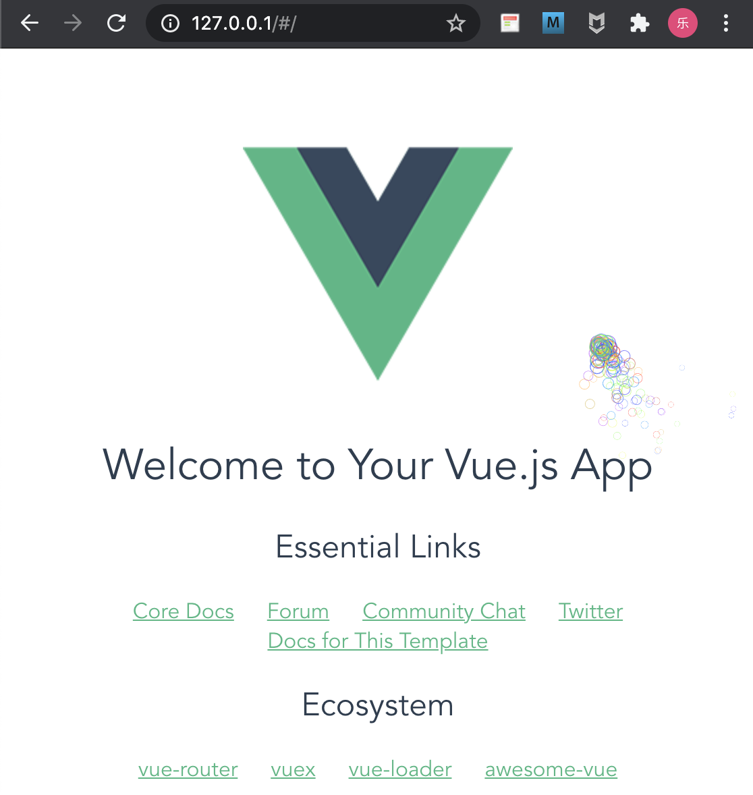

# teaching_gf_web_develop_element
教女朋友学习网页开发_前端部分


> A Vue.js project

## 常用命令

``` bash
# install dependencies
npm install

# serve with hot reload at localhost:8080
npm run dev

# build for production with minification
npm run build

# build for production and view the bundle analyzer report
npm run build --report
```


## 开发环境


```
vue init webpack teaching_gf_web_develop_vue_element
# 参见 https://www.toutiao.com/a6911515329197834766/
```


其中，`/config/index.js`文件内，


```
host: 'localhost', // can be overwritten by process.env.HOST
```


要替换为


```
host: '0.0.0.0', // can be overwritten by process.env.HOST
```


# 运行


```
docker run --rm -itd --name vue-test -v "$PWD":/web-proj/ -w /web-proj/ -p 80:8080 virhuiai/teaching_gf_web_develop_element:latest npm run dev
```




